# Gaylord · le bot Discord d'aboeka.fr

Bot Discord unifié (successeur de BotGSTAR) qui fait vivre le serveur de ma promo
d'informatique (le **Discord ISTIC**). Il gère trois choses :

- **Veille RSS** : chaque matin, il rassemble mes sources tech et politique et poste un
  digest trié et noté dans des salons dédiés (`!veille` côté tech, `!vp` côté politique).
- **Pipeline aboeka.fr** : il détecte les liens déposés dans `🔗・liens`, déclenche la
  génération d'une fiche d'analyse via l'API d'aboeka.fr, et publie la fiche dans les forums.
- **Cours ISTIC** : commandes `!cours`, watcher de corrections, forums correction et perso.

> Discord ouvert aux étudiants de la promo : https://discord.gg/Mnx2p3dkbV
> Le site, lui, est sur https://aboeka.fr (la veille y est aussi, en lecture seule, sans Discord).

---

## La veille en images

De vrais digests, capturés le même matin (vendredi 19 juin 2026) dans les salons du serveur.
La tech et la politique d'abord, puis les coulisses des logs.

**Veille tech** (4 salons)

| | |
|---|---|
| 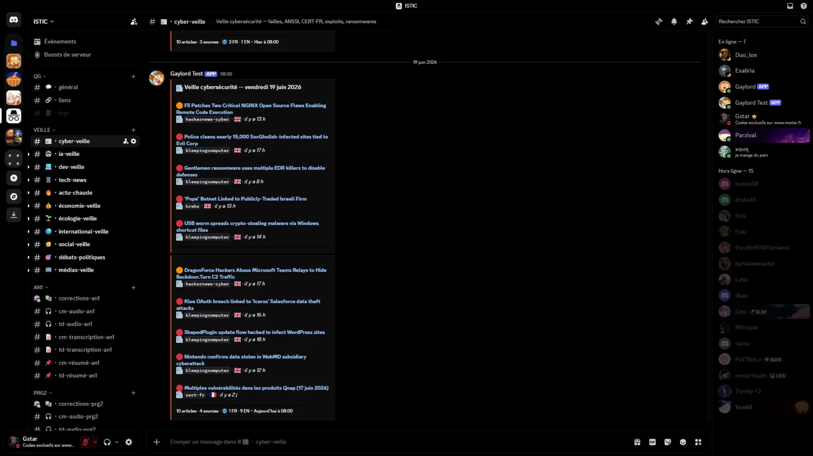 `#cyber-veille` : CVE, malwares, alertes, notés et datés | 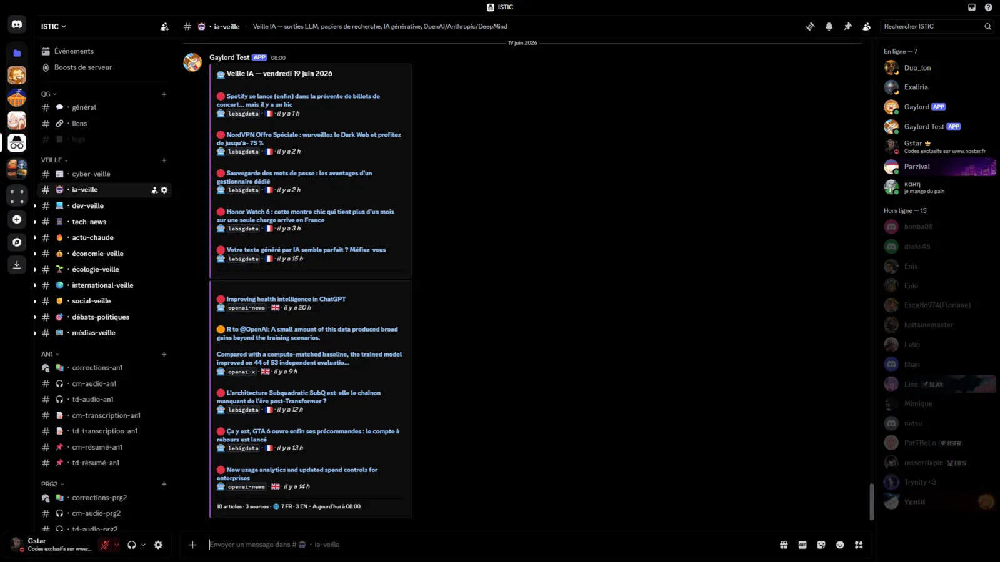 `#ia-veille` : OpenAI, Anthropic, recherche |
| 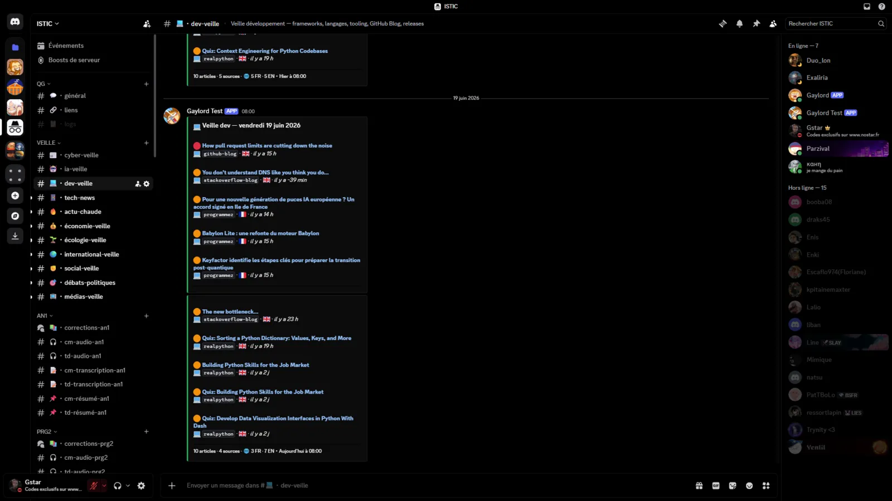 `#dev-veille` : releases, breaking changes, advisories | 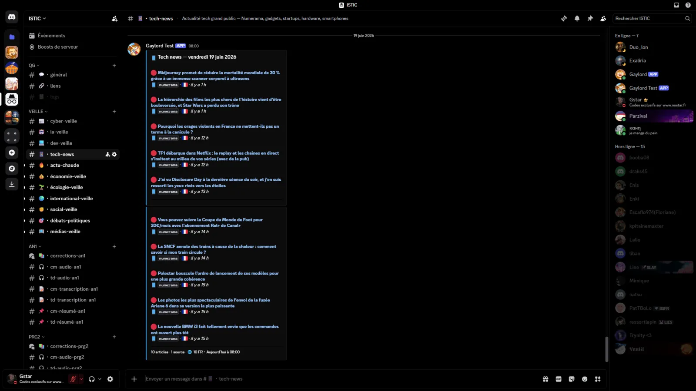 `#tech-news` : tech grand public, réglementation |

**Veille politique** (7 salons, rangés par question d'usage)

| | |
|---|---|
| 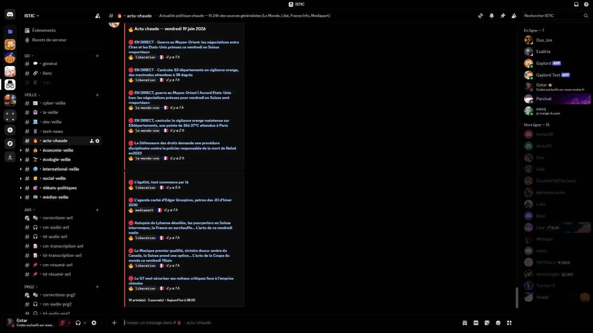 `#actu-chaude` : ce qui se passe ce matin | 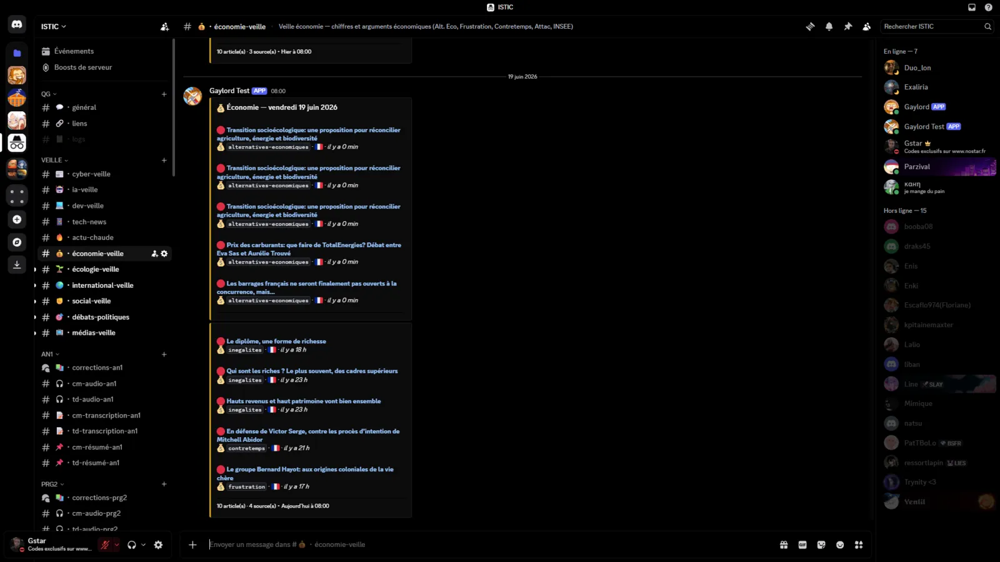 `#économie-veille` : chiffres et arguments |
| 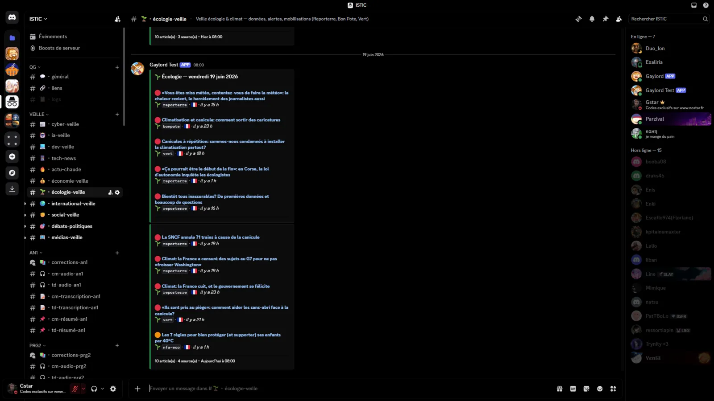 `#écologie-veille` : données climat |  `#international-veille` : Palestine, Russie, Sahel |
| 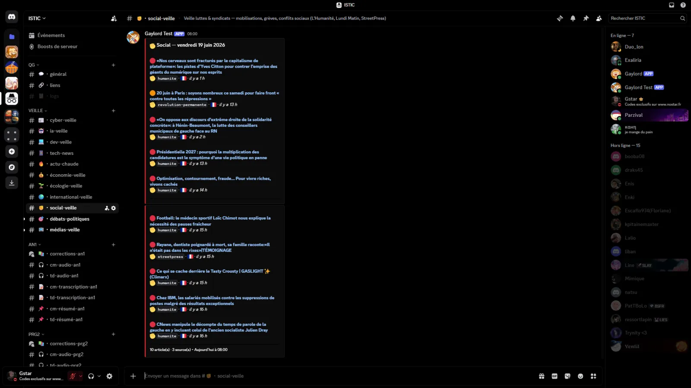 `#social-veille` : luttes, syndicats | 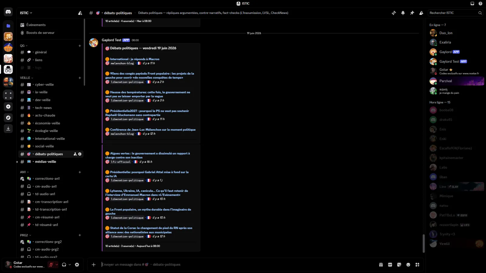 `#débats-politiques` : angles d'argumentation |
| 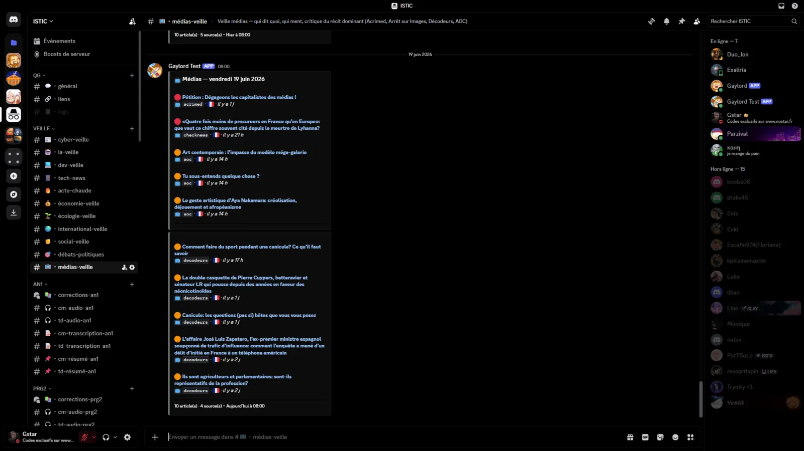 `#médias-veille` : qui dit quoi, qui ment | |

**Les coulisses** (salon `#logs`)

| | |
|---|---|
| 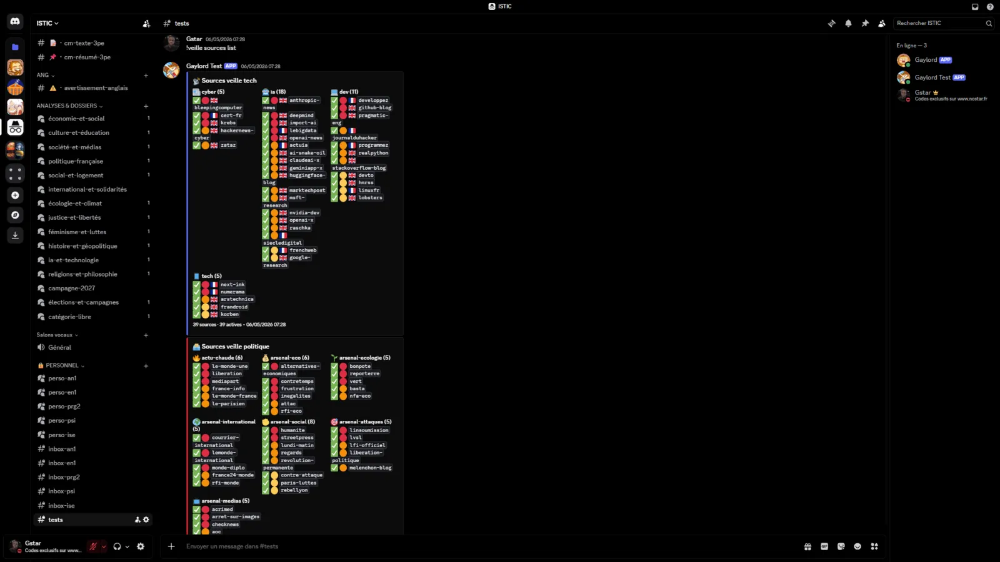 Le récap de l'état des sources, actives ou désactivées | 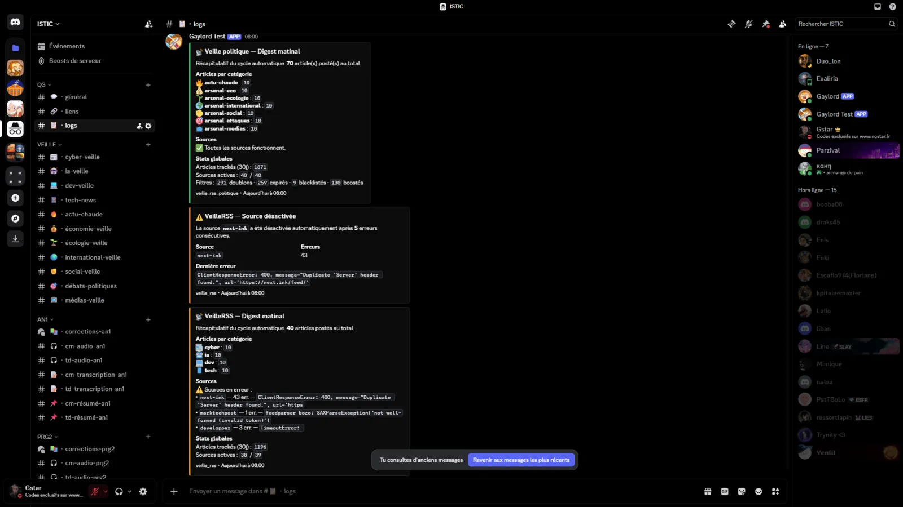 Le récap du digest matinal et la coupure auto d'une source en panne |

---

## Comment marche la veille

Deux cogs jumeaux : `veille_rss` (tech) et `veille_rss_politique` (politique, « Option C »,
catégories par usage plutôt que par camp). Même moteur des deux côtés.

- **Digest matinal à 8h** (heure de Paris), avec rattrapage si le bot était éteint au créneau.
- **Scoring** : chaque article est noté selon la priorité de la source, sa fraîcheur et des
  mots-clés boost. Le bot ne garde que le top par catégorie, pour éviter le bruit.
- **Dédoublonnage sur 30 jours** : une empreinte MD5 du lien évite de reposter un article déjà vu.
- **Fenêtres de fraîcheur** : on ignore le vieux (24 h pour la tech grand public, jusqu'à 72 h
  pour cyber, IA et dev).
- **Sources qui s'auto-coupent** : une source qui plante cinq fois d'affilée est désactivée
  toute seule et signalée dans les logs, pour ne pas traîner un flux mort.
- **Gestion à chaud** : `!veille sources list/add/remove/toggle/test`, `!veille reload`,
  `!veille fetch-now`, `!veille status` (et `!vp ...` côté politique).

Sources et scoring vivent dans `datas/rss_sources*.yaml` et `datas/rss_keywords*.yaml`.

> La même veille existe en version site sur aboeka.fr : les mêmes sources RSS, en lecture seule,
> dédupliquées et rangées par date, sans compte ni Discord. Le bot, lui, est le rituel du matin
> qui note et sélectionne ; le site est l'archive ouverte et parcourable.

---

## Le pont vers aboeka.fr (fiches d'analyse)

Le bot écoute `🔗・liens`. À chaque lien (TikTok, Instagram, YouTube, X, Reddit) déposé :

1. Il appelle `POST /api/bot/generate` sur aboeka.fr (file sérialisée, une URL à la fois).
2. Il suit le job (download, transcription Whisper, captures, note sur 20) et publie la fiche
   dans le bon forum thématique, anti-doublon compris.
3. Le `_reception_poller` (toutes les 30 s) récupère la réception (analyse notée des
   commentaires) dès qu'elle est prête et la poste sous la fiche, dans son thread forum.

Le gros calcul tourne côté serveur aboeka.fr ; le bot n'est que le pont Discord.

### Capture des commentaires en un clic (depuis aboeka.fr)

Les commentaires des plateformes qui ne les exposent pas (TikTok, X, Instagram, Threads) ne
sont plus saisis seulement via Discord : sur la fiche aboeka.fr, un bouton **« Capturer les
commentaires »** ouvre le post et l'extension Chrome Arsenal les capture et les renvoie
directement sur la fiche (compteur live, bouton « Arrêter », cap à 100). L'admin lance ensuite
l'analyse via **« Analyser la réception »**. Côté Discord, rien à faire de plus :

- aboeka.fr journalise ces actions dans `📋・logs` (capture, lancement d'analyse) via webhook ;
- le `_reception_poller` du bot détecte la réception fraîche et **met à jour le thread forum**
  de la fiche automatiquement (anti-doublon `data/reception_posted.json`).

Autrement dit : capturer depuis le site suffit, le thread Discord se complète tout seul.

### Fiches générées uniquement depuis le site

Une fiche peut être produite sans passer par `🔗・liens` (atelier admin sur aboeka.fr). Le
`_publish_poller` (toutes les 60 s, instance `PROCESS_LINKS=true`) interroge
`GET /api/bot/fiches` (fiches publiques marquées `discord_thread`) et **crée leur thread
forum** s'il manque, via `publish_fiche` (idempotent). Le corpus importé historique et les
fiches privées de membres ne sont jamais renvoyés par cet endpoint : pas de thread pour eux.

---

## Fichiers principaux

| Fichier | Rôle |
|---|---|
| `bot.py` | Entry point (`AboekaBot`) : liens, cogs, worker, réception |
| `publisher.py` | Routing des fiches vers les forums Discord |
| `bot_tray.py` | Watchdog tray (auto-restart, icône système) |
| `start_tray.vbs` | Lanceur silencieux (startup Windows) |
| `extensions/` | Cogs : `cours_pipeline`, `veille_rss`, `veille_rss_politique` |
| `datas/` | Sources YAML, scoring, tracking des publications |

## Lancer

```bash
# Mode tray (normal) : double-clic sur start_tray.vbs
# Mode console (debug) :
python bot.py
```

## Config `.env`

```
DISCORD_BOT_TOKEN=
ABOEKA_API_BASE=https://aboeka.fr   # ou http://127.0.0.1:3000 en dev
ABOEKA_BOT_SECRET=                  # doit correspondre à web/.env côté aboeka.fr
BOT_INSTANCE=local                  # local (prioritaire) ou server (secours)
PROCESS_LINKS=true                  # false = n'écoute pas les liens (cours et veille seulement)
```

Copier `.env.example` vers `.env` et remplir les valeurs. Voir `CLAUDE.md §6` pour la liste complète.

---

## Documentation

- [`CLAUDE.md`](CLAUDE.md) : architecture, commandes, storage, démarrage
- [`CONTEXTE.md`](CONTEXTE.md) : historique des phases, état courant, TODO